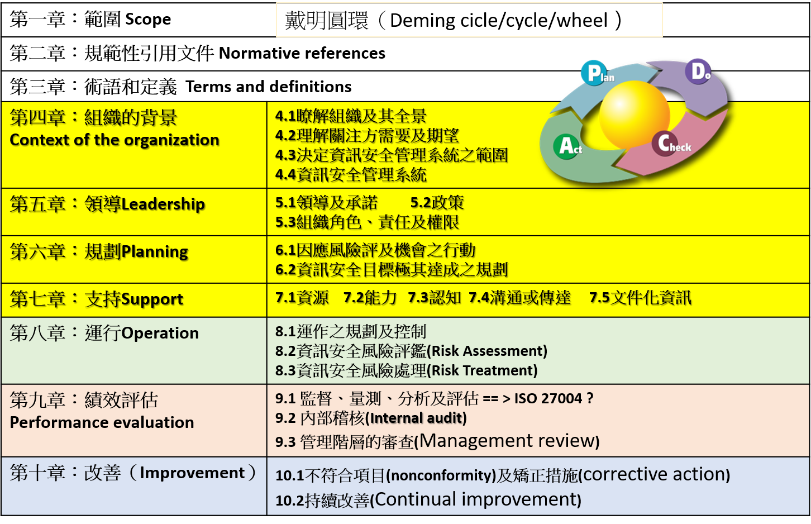

# ISMS與ISO 27001
- 資訊安全管理系統 Information security `management systems(管理系統)`  ==> 制度
  - 新版(2022|已經是第三代)與舊版(2013|第二代)
    - ISO/IEC 27001:2013 Information technology — Security techniques — Information security management systems — Requirements 
  - ISO/IEC 27001:2022 Information security, cybersecurity and privacy protection — Information security management systems — Requirements(要求) | Edition : 3 | Number of pages : 19
  - ISO/IEC 27002:2022 Information security, cybersecurity and privacy protection — Information security controls | Edition : 3 | Number of pages : 152
  - 資訊安全管理系統(ISMS)-內容架構

  - ISO的`management systems管理系統: | ISMS | PIMS | BCMS | AIMS |
    - ISO/IEC 27001:2022 Information security, cybersecurity and privacy protection — Information security management systems — Requirements(要求)
    - PIMS
      - ISO/IEC 27701:2019 Security techniques — Extension to ISO/IEC 27001 and ISO/IEC 27002 for privacy information management — Requirements and guidelines
      - 快要上市 ISO/IEC FDIS 27701 Information security, cybersecurity and privacy protection — Privacy information management systems — Requirements and guidance
    - ISO 22301:2019　Security and resilience — Business continuity management systems — Requirements
  - security controls
  - ISO/IEC 42001:2023 Information technology — Artificial intelligence — Management system
  - ISO/IEC 27001：2022版本 
    - 4 大關鍵領域(2013版本:14 個)  參考Annex A(normative) Information security controls reference
      - 1.組織控制措施Organizational controls(5.1-5.37)
      - 2.人員控制措施People controls(6.1-6.8)
      - 3.實體環境控制措施 Physical controls  (7.1-7.14)
      - 4.技術控制措施  Technological controls (8.1-8.34)
    - 93項控制措施(2013版本:114 項) 部分控制措施被合併，另一些被刪除，引入了新的控制措施(11個)，還有一些做更新
  - ISMS導入 ==> PDCA
  - ISMS導入對`機關人員`之影響(四點)
  - ISMS導入後對`機關`之影響(五點)
  - ISMS建置流程
  - [ISO 27001：2022資訊安全管理系統主導稽核員訓練課程](https://www.uuu.com.tw/Course/Show/1600/ISO-27001-2013%E8%B3%87%E8%A8%8A%E5%AE%89%E5%85%A8%E7%AE%A1%E7%90%86%E7%B3%BB%E7%B5%B1%E4%B8%BB%E5%B0%8E%E7%A8%BD%E6%A0%B8%E5%93%A1%E8%A8%93%E7%B7%B4%E8%AA%B2%E7%A8%8B)

## 安全控制措施與ISO 27002
- ISO/IEC 27001:2022 Annex A(normative) Information security controls reference 清單列表 ==> 總共才16頁 
- ISO/IEC 27002:2022 厚達 152頁 ==> 逐項說明
- 引入新的5大屬性
  - 1.控制措施類型Control type==>
    - Preventive`預防型`(旨在`防止`資訊安全事故發生之控制措施)
    - Detective `偵測型` (於資訊安全事故發生時採取之控制措施)
    - Corrective `矯正型`(於資訊安全事故發生後採取行之控制措施)
  - 2.資訊安全性質 Information Security Properties  ==> > Confidentiality、Integrity 及 Availability
  - 3.網路安全概念Cybersecurity Concepts ==> 
    - 對應到 NIST CSF 架構的哪一個?  ==> 辨識(IDENTIFY)| 保護(PROTECT)	|偵測(DETECT)	|應變(RESPOND)
    - ISO 27001:2022 == > NIST CSF 1.1   <====NIST CSF 2.0 (2024/2)
  - 4.執行能力Operational Capabilitie
  - 5.安全領域 Security Domains
- 範例說明: 8. 13系統資料備份(Information backup)
- 範例說明: 
 
