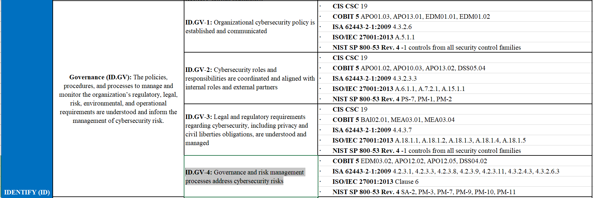

# NIST CSF(Cybersecurity Framework)
- 網路安全框架(Cybersecurity Framework, CSF)為美國國家標準暨技術研究院(National Institute of Standards and Technology,NIST)提出，作為整體網路安全架構之規劃藍圖參考
- NIST CSF 1.0版 最早是2014年發布，當時主要目的是為了強化關鍵基礎設施的網路安全。
  - 源自美國總統歐巴馬在2013年2月，發布了第13636號行政命令（EO），要求該國NIST根據現有的標準與指南，訂立一套可供關鍵基礎設施採用的資安框架，以此強化網路安全。
- NIST CSF 1.1版
  - 2018年4月，CSF 1.1版發布，這次改版最大意義在於擴展運用範圍，不僅涵蓋先前注重的關鍵基礎設施，同時，也要讓所有的企業環境都能適用
  - 易於實施的5大核心功能，並具有靈活應用的彈性，幫助各組織可以更好地理解、減少與溝通網路安全風險。 
- NIST CSF 2.0版 2024年2月CSF 2.0版發布:6個關鍵功能、22 個類別與106個子類別
## NIST
- 美國國家標準暨技術研究院(National Institute of Standards and Technology,NIST)
- [NIST Cybersecurity](https://www.nist.gov/cybersecurity)
- [NIST CSF:The Cybersecurity Framework](https://www.nist.gov/cyberframework)
  - [NIST網路安全框架當紅 2019](https://www.ithome.com.tw/article/133173)
  - [NIST CSF 2](https://today.ithome.com.tw/tags/nist-csf)
- [NIST PRIVACY FRAMEWORK](https://www.nist.gov/privacy-framework)
  - NIST Privacy Framework 1.1 
- [NIST AI Risk Management Framework (AI RMF)](https://www.nist.gov/itl/ai-risk-management-framework)
- National Vulnerability Database(NVD)

### NIST CSF 1.1版


- 治理（ID.GV）： 企業用來管理和監控其法規、法律(legal)、風險(risk)、環境(environmental)和營運要求(operational requirements)的`政策(policies)、程序(procedures)和流程(processes)`，應被充分理解，並用於指導`資安風險管理(the management of cybersecurity risk)`。
- ID.GV-1: 組織的資安政策已建立並傳達Organizational cybersecurity policy is established and communicated
- ID.GV-2: 資安`角色(roles)`和`責任(responsibiliti)`已協調，並與內部職務及外部夥伴對齊。Cybersecurity roles and responsibilities are coordinated and aligned with internal roles and external partners
- ID.GV-3:與資安相關的`法律(Legal)`與`法規(regulatory)`要求，包括`隱私權(privacy`)與`公民自由義務(civil liberties obligations)`，均被理解並加以管理。Legal and regulatory requirements regarding cybersecurity, including privacy and civil liberties obligations, are understood and managed
- ID.GV-4:治理與風險管理流程`涵蓋`資安風險Governance and risk management processes `address` cybersecurity risks

### NIST CSF 2.0版 
- 六大核心功能: `治理（Govern）[新增]`、識別（Identify）、保護（Protect）、偵測（Detect）、回應（Respond）、復原（Recover）。

# IPAS_中階_題型
```
網路安全框架(Cybersecurity Framework, CSF)為美國國家標準暨技術研究院
(National Institute of Standards and Technology,NIST)彙整後所提出，
作為整體網路安全架構之規劃藍圖參考，請問該CSF之 組成元素包含下列哪些項目?
(A) 框架核心(Framework Core)            (B) 框架設定檔(Framework Profile)
(C) 實施程序(Framework Procedure)   (D) 實施層級(Implementation Tiers)
```

```
NIST網路安全框架(Cybersecurity Framework, CSF）有關「框架核心（ Framework Core）」係由識別 Identify）、保護Protect）、偵測 Detect）、回應 Respond）與復原 Recover等功能所組成。
請問關於「保護（ Protect）」功能的敘述，下列哪些正確？
(A) 包含身份管理與存取控制(Identity Management and Access Control)與意識和訓練(Awareness and Training)
(B) 包含資料安全(Data Security)與資訊保護流程與程序(Information Protection Processes and Procedures)
(C) 包含維護(Maintenance)與保護技術(Protective Technology)
(D) 包含資產管理(Asset Management)與風險評估(Risk Assessment)

```
