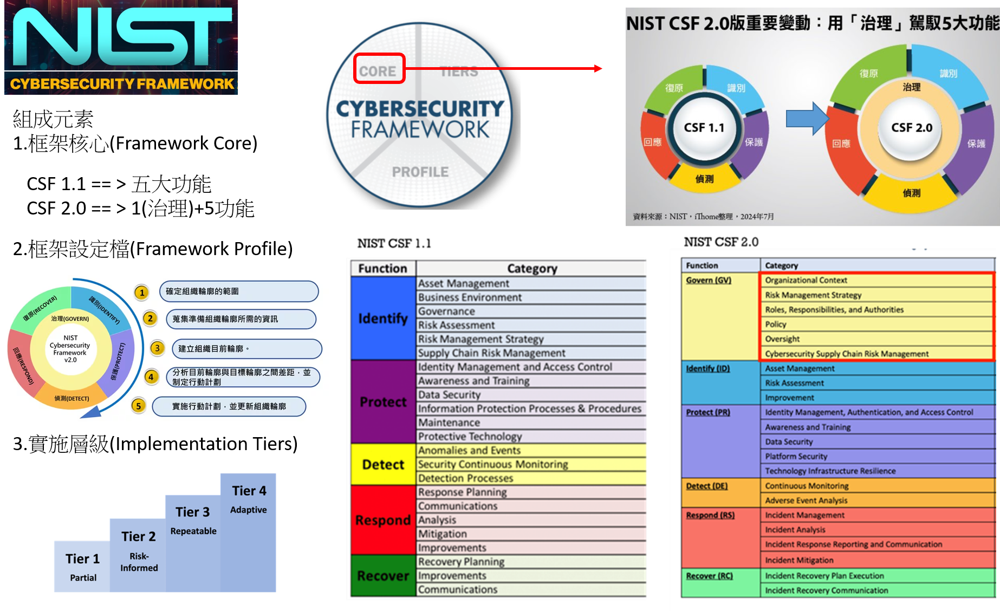
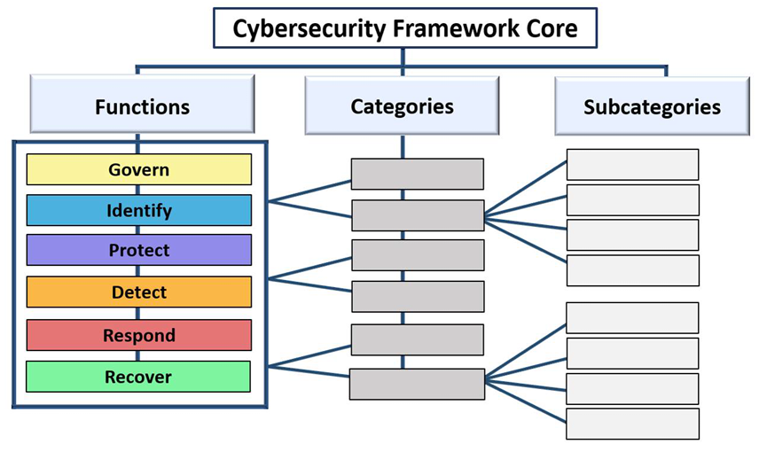

# NIST CSF(Cybersecurity Framework)
- 網路安全框架(Cybersecurity Framework, CSF)為美國國家標準暨技術研究院(National Institute of Standards and Technology,NIST)提出，作為整體網路安全架構之規劃藍圖參考
- NIST CSF 1.0版
  - 最早是2014年發布，當時主要目的是為了強化關鍵基礎設施的網路安全。
  - 源自美國總統歐巴馬在2013年2月，發布了第13636號行政命令（EO），要求該國NIST根據現有的標準與指南，訂立一套可供關鍵基礎設施採用的資安框架，以此強化網路安全。
- [NIST CSF 1.1版](NIST_CSF_v1_1_2018-04-16_framework_core.xlsx)
  - 2018年4月，CSF 1.1版發布，這次改版最大意義在於擴展運用範圍，不僅涵蓋先前注重的關鍵基礎設施，同時，也要讓所有的企業環境都能適用
  - 易於實施的5大核心功能，並具有靈活應用的彈性，幫助各組織可以更好地理解、減少與溝通網路安全風險。 
- [NIST CSF 2.0版](csf2.xlsx)
  - 2024年2月CSF 2.0版發布
  - (1+5==) 6個關鍵功能、22 個類別與106個子類別
## NIST
- 美國國家標準暨技術研究院(National Institute of Standards and Technology,NIST)
- [NIST Cybersecurity](https://www.nist.gov/cybersecurity)
- [NIST CSF:The Cybersecurity Framework](https://www.nist.gov/cyberframework)
  - [NIST網路安全框架當紅 2019](https://www.ithome.com.tw/article/133173)
  - [NIST CSF 2](https://today.ithome.com.tw/tags/nist-csf)
- [NIST PRIVACY FRAMEWORK](https://www.nist.gov/privacy-framework)
  - NIST Privacy Framework 1.1 
- [NIST AI Risk Management Framework (AI RMF)](https://www.nist.gov/itl/ai-risk-management-framework)
- National Vulnerability Database(NVD)



### NIST CSF 1.1版


- 治理（ID.GV）： 企業用來管理和監控其法規、法律(legal)、風險(risk)、環境(environmental)和營運要求(operational requirements)的`政策(policies)、程序(procedures)和流程(processes)`，應被充分理解，並用於指導`資安風險管理(the management of cybersecurity risk)`。
- ID.GV-1: 組織的資安政策已建立並傳達Organizational cybersecurity policy is established and communicated
- ID.GV-2: 資安`角色(roles)`和`責任(responsibiliti)`已協調，並與內部職務及外部夥伴對齊。Cybersecurity roles and responsibilities are coordinated and aligned with internal roles and external partners
- ID.GV-3:與資安相關的`法律(Legal)`與`法規(regulatory)`要求，包括`隱私權(privacy`)與`公民自由義務(civil liberties obligations)`，均被理解並加以管理。Legal and regulatory requirements regarding cybersecurity, including privacy and civil liberties obligations, are understood and managed
- ID.GV-4:治理與風險管理流程`涵蓋`資安風險Governance and risk management processes `address` cybersecurity risks

##### NIST 800-53 
- 🔒 NIST 800-53 是一份由美國國家標準與技術研究院 (NIST) 發布的資訊安全文件，提供組織建立資訊安全管理系統 (ISMS) 的建議。它涵蓋了資訊安全管理的各個方面，包括風險評估、安全控制、安全事件應變等。
- 🔐 NIST 800-53 的重要性: NIST 800-53 是美國政府機構和承包商的強制性安全標準，也廣泛被其他組織採用。
  - 它提供了一個全面的資訊安全框架，幫助組織保護其資訊資產。
  - 共通規範|安全控制措施參考指引v4.1_1121127 ==> NIST SP 800-53 + 800-53 B 
    - 本指引建議之安全控制措施，共分為20 類、298 項，涵蓋導入ISMS 之所有過程，其中7 類屬技術類，13 類屬管理類，機關可依據系統之安全等級，選擇適用之安全與隱私控制措施
  - 共通規範|資通系統防護基準驗證實務(V1.1)_1110928 ==> NIST SP 800-53A
- 🌎 NIST 800-53 的國際影響 NIST 800-53 已經成為全球資訊安全標準的基石，許多國家和地區都參考其內容制定本地的資訊安全法規和標準
- 🌎 NIST 800-53 最新版本 Rev. 5  (CSF 1.1使用的是 Rev. 4版)
  - NIST SP 800-53 Rev. 5(2020) Security and Privacy Controls for Information Systems and Organizations
  - NIST SP 800-53A Rev. 5(2022) Assessing Security and Privacy Controls in Information Systems and Organizations
  - NIST SP 800-53B(2020) Control Baselines for Information Systems and Organizations

### NIST CSF 2.0版 
- NIST Cybersecurity Framework (Framework or CSF)包含三大`組成(components)`
  - `1`.CSF Core(CSF 核心功能)
    - 這是CSF 的核心部分，它是一個高層次的資安結果分類法，能夠幫助任何組織管理其網路安全風險。
    - CSF 核心的組成包括 功能 (Functions)、類別 (Categories) 和子類別 (Subcategories)，詳細描述每個資安結果。


      
    - 這些結果可以被 高層主管、經理和專業人士理解，無論他們的資安專業程度如何。
    - 由於這些結果 不受產業、國家或技術限制，它們提供了組織靈活性，以便根據自身的風險、技術及使命進行調整。
  - `2`.CSF 組織檔案 (Organizational Profiles)
    - 這是一種機制，用來描述組織`目前(current)`或`目標(target|未來想要到的)`的資安狀態，並以 CSF Core的結果來呈現。
  - `3`.CSF `層級(Tiers)`：==>(哪一級的成熟度)
    - 可應用於 CSF 組織檔案，來評估組織的資安風險治理與管理實踐的嚴謹程度。
    - `層級(Tiers)`也可用於提供組織如何看待資安風險及其管理方式的背景資訊。
    - 執行層級由低到高，NIST總共區分為`4`個等級
      - 最低的層級1為`部分實行（Partial）`
      - 其次層級2是`已發覺風險（Risk Informed）`
      - 成熟度較佳的層級3，代表的是現在的措施能夠`重復執行（Repeatable）`
      - 層級4是最成熟的階段，稱做`完全適應（Adaptive）`，不只代表企業的做法相當成熟，同時持續推動改善計畫，成為相當良好的執行循環。
- 六大核心功能:
  - `治理（Govern）[新增]`
    - GOVERN 功能提供了各項成果，使組織能夠決定如何實現及優先考量其他五項功能的目標，並確保符合其使命與利害關係人的期望。
    - 治理活動在將資安納入組織更廣泛的企業風險管理 (ERM) 策略中至關重要。
    - GOVERN 涵蓋：
      - `1`.Organizational Context (GV.OC)組織背景的理解
        - [CSF_2_範例說明.md](CSF_2_範例說明.md) 
      - `2`.Risk Management Strategy (GV.RM):風險管理策略
      - `3`.角色、職責與權限[Roles, Responsibilities, and Authorities (GV.RR)]
      - `4`.Policy (GV.PO):政策的建立與管理
      - `5`.Oversight (GV.OV)資安策略的監督 
      - `6`.Cybersecurity Supply Chain Risk Management (GV.SC):資安供應鏈風險管理
  - 識別（Identify）
    - `1`.Asset Management (ID.AM) 資產管理
    - `2`.Risk Assessment (ID.RA) 風險評鑑
    - `3`.Improvement (ID.IM) 改善
  - 保護（Protect）
    - `1`.Identity Management(身分管理), Authentication(驗證), and Access Control(存取控制) (PR.AA):
    - `2`.Awareness(認知) and Training(教育訓練) (PR.AT)
    - `3`.Data Security |資料安全|(PR.DS):
    - `4`.Platform Security|平台安全| (PR.PS)
    - `5`.Technology Infrastructure Resilience韌性 (PR.IR)
  - 偵測（Detect）
    - `1`.Continuous Monitoring (DE.CM)| 持續安全監控
    - `2`.Adverse Event Analysis (DE.AE):{不利的、負面的、有害的、惡劣、敵對}事件分析
      - Anomalies(異常狀況), indicators of compromise(IOC入侵指標), and other potentially adverse `events(事件)` are analyzed to characterize the events and detect cybersecurity `incidents(事故)`
      - 異常狀況、入侵指標及其他潛在的不利事件皆被分析，被用來描述事件特徵並用來偵測`資安事故(incidents)`。
  - 回應（Respond） ==> 針對`資安事故(incidents)`
    - `1`.Incident Management管理 (RS.MA):
    - `2`.Incident Analysis分析 (RS.AN)
    - `3`.Incident Response Reporting and Communication 報告與溝通 (RS.CO):
    - `4`.Incident Mitigation 緩解(RS.MI):
  - 復原（Recover）災難復原|事故後復原
    - `1`.Incident Recovery Plan Execution (RC.RP):
    - `2`.Incident Recovery Communication (RC.CO)

# IPAS_中階_題型
```
網路安全框架(Cybersecurity Framework, CSF)為美國國家標準暨技術研究院
(National Institute of Standards and Technology,NIST)彙整後所提出，
作為整體網路安全架構之規劃藍圖參考，請問該CSF之 組成元素包含下列哪些項目?
(A) 框架核心(Framework Core)            (B) 框架設定檔(Framework Profile)
(C) 實施程序(Framework Procedure)   (D) 實施層級(Implementation Tiers)
```

```
NIST網路安全框架(Cybersecurity Framework, CSF）有關「框架核心（ Framework Core）」係由識別 Identify）、保護Protect）、偵測 Detect）、回應 Respond）與復原 Recover等功能所組成。
請問關於「保護（ Protect）」功能的敘述，下列哪些正確？
(A) 包含身份管理與存取控制(Identity Management and Access Control)與意識和訓練(Awareness and Training)
(B) 包含資料安全(Data Security)與資訊保護流程與程序(Information Protection Processes and Procedures)
(C) 包含維護(Maintenance)與保護技術(Protective Technology)
(D) 包含資產管理(Asset Management)與風險評估(Risk Assessment)

```
