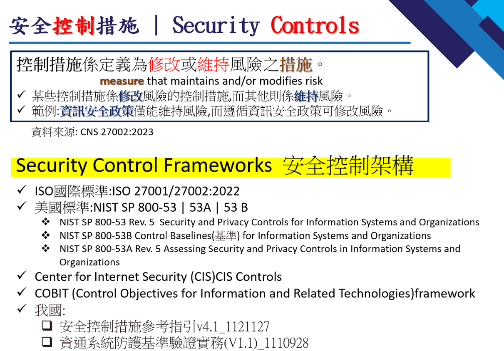
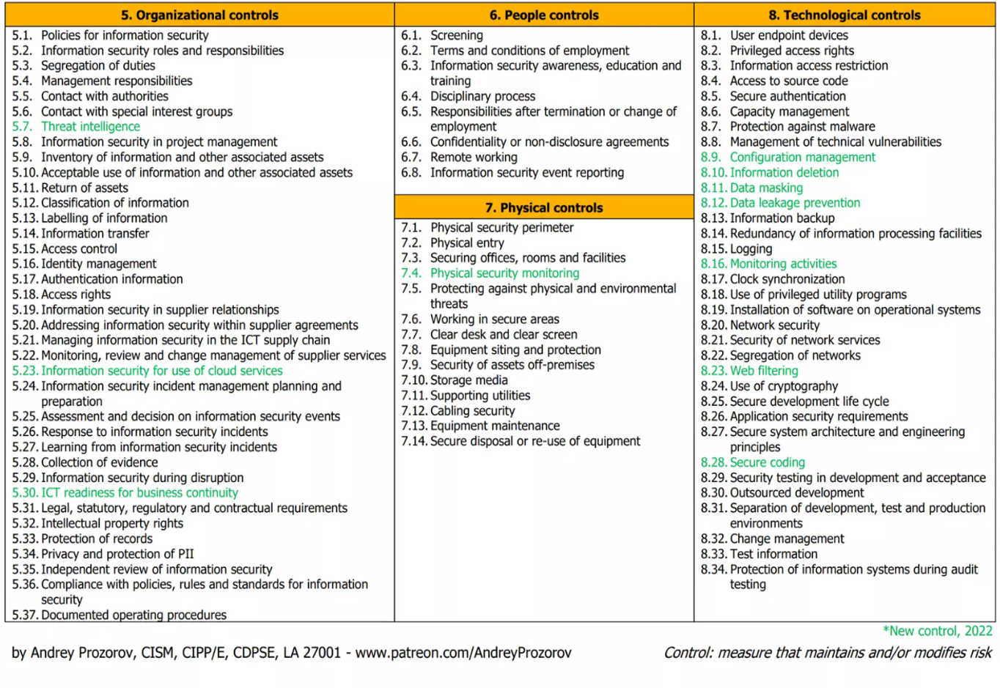

## Security Controls

## Security Controls ==> ISO 27001/27002
- ISO/IEC 27001:2013  14個關鍵領域(114 controls)
- ISO/IEC 27001:2022  4 大關鍵領域 (93 controls)
  - 組織  5 Organizational controls(5.1-5.37)
  - 人員  6 People controls  (6.1-6.8)
  - 實體  7 Physical controls (7.1-7.14)
  - 技術  8 Technological controls (8.1-8.34)

- 資料來源: https://www.slideshare.net/AndreyProzorov/iso-270012022-introduction

## NIST SP 800-53
- NIST SP 800-53, Revision 5
  - AC: Access Control
  - AT: Awareness and Training
  - AU: Audit and Accountability
  - CA: Assessment, Authorization, and Monitoring
  - CM: Configuration Management
  - CP: Contingency Planning
  - IA: Identification and Authentication
  - IR: Incident Response
  - MA: Maintenance
  - MP: Media Protection
  - PE: Physical and Environmental Protection
  - PL: Planning
  - PM: Program Management
  - PS: Personnel Security
  - PT: Personally Identifiable Information Processing and Transparency
  - RA: Risk Assessment
  - SA: System and Services Acquisition
  - SC: System and Communications Protection
  - SI: System and Information Integrity
  - SR: Supply Chain Risk Management
### [Critical Security Controls v8.1]() 
- 1: Inventory and Control of Enterprise Assets
- 2: Inventory and Control of Software Assets
- 3: Data Protection
- 4: Secure Configuration of Enterprise Assets and Software
- 5: Account Management
- 6: Access Control Management
- 7: Continuous Vulnerability Management
- 8: Audit Log Management
- 9: Email and Web Browser Protections
- 10: Malware Defenses
- 11: Data Recovery
- 12: Network Infrastructure Management
- 13: Network Monitoring and Defense
- 14: Security Awareness and Skills Training
- 15: Service Provider Management
- 16: Application Software Security
- 17: Incident Response Management
- 18: Penetration Testing

### [CSA Cloud Controls Matrix (CCM)](https://cloudsecurityalliance.org/research/cloud-controls-matrix) 
- [Cloud Controls Matrix Version 4.0](https://csf.tools/reference/cloud-controls-matrix/v4-0/)
- A&A: Audit & Assurance
- AIS: Application & Interface Security
- BCR: Business Continuity Management and Operational Resilience
- CCC: Change Control and Configuration Management
- CEK: Cryptography, Encryption & Key Management
- DCS: Datacenter Security
- DSP: Data Security and Privacy Lifecycle Management
- GRC: Governance, Risk and Compliance
- HRS: Human Resources
- IAM: Identity & Access Management
- IPY: Interoperability & Portability
- IVS: Infrastructure & Virtualization Security
- LOG: Logging and Monitoring
- SEF: Security Incident Management, E-Discovery, & Cloud Forensics
- STA: Supply Chain Management, Transparency, and Accountability
- TVM: Threat & Vulnerability Management
- UEM: Universal Endpoint Management
