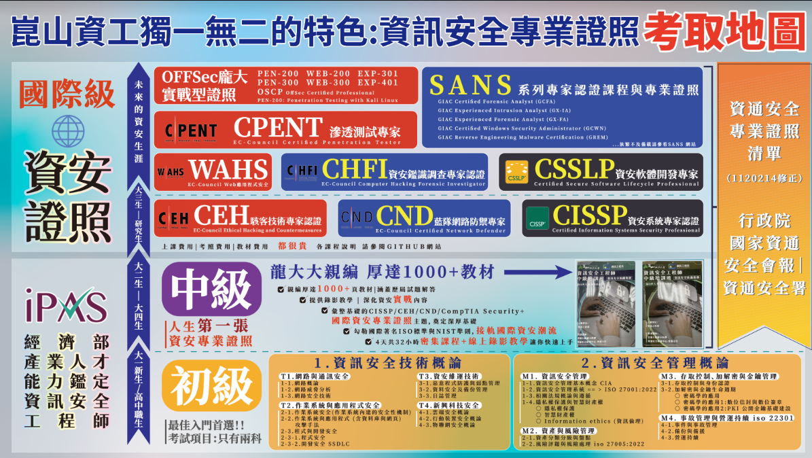

# 資安職能證照
- 資通安全概論(三天課程)
- 更多進階課程 請參閱並請多多參加
  - [資安職能 - 國家資通安全研究院](https://ctts.nics.nat.gov.tw/about/Training) 

# 資安專業證照:政府推動的IPAS資安專業證照
- IPAS經濟部產業人才能力鑑定 Industry Professional Assessment System
  - [資訊安全工程師](https://www.ipas.org.tw/ISE) 
  - [歷年考試成果](https://www.ipas.org.tw/ISE/AbilityPageContent.aspx?pgeno=b53d1159-f9d1-415b-bd2f-b915ae16e39d)
  - [初級資訊安全工程師能力鑑定](https://www.ipas.org.tw/ISE/AbilityExamBulletinList.aspx?exmno=53521ea9-1f19-4f78-a13c-00e51edf943e)
    - 特別留意: 此課程`不是`「行政院國家資通安全會報」認可之資通安全專業證照
    - 考試項目 :1.資訊安全管理概論 2.資訊安全技術概論
  - 👍 [中級資訊安全工程師能力鑑定](https://www.ipas.org.tw/ISE/AbilityExamBulletinList.aspx?exmno=8af59a16-8cff-4f54-8e2a-bd08d280fefe)
    - 此課程為「行政院國家資通安全會報」認可之資通安全專業證照
    - 考試項目 :1. 資訊安全規劃實務 2. 資訊安全防護實務
    - 內容有深度,比較難自修
    - 參閱 龍大大開設的四天 IPAS 中級資訊安全工程師證照班


# 資安專業證照:國際資安專業證照

# Security Certification Road Map證照路



# 國家級(經濟部)資安專業證照
- IPAS 中階資安工程師證照
  - 初階證照只是入門,適於初學者
  - 中階才是 【行政院國家資通安全會報｜資通安全署 通過之 資通安全專業證照（1120214修正）】
# 國際資安專業證照
## CISSP
- Certified Information Systems Security Professional
- 【行政院國家資通安全會報｜資通安全署 通過之 資通安全專業證照（1120214修正）】
- 國際公認最具權威的資訊安全專業人員證照
- 考試內容:CISSP需具有資訊安全通識體系八大領域的知識與能力
```
Domain 1: 安全與風險管理Security and Risk Management
Domain 2: 資產安全Asset Security
Domain 3: 安全架構與工程Security Architecture and Engineering
Domain 4: 通訊與網路安全Communication and Network Security
Domain 5: 身份與存取管理Identity and Access Management 
Domain 6: 安全評估與測試Security Assessment and Testing
Domain 7: 安全作業Security Operations
Domain 8: 軟體開發安全Software Development Security
```
- 適合對象:大三大四~研究生
- 資安專業證照學習地圖:
  - 建議先取得經濟部產業人才能力鑑定|IPAS中階資訊安全工程師證照後再循序學習
- 崑山資工搭配課程:資訊安全規劃與管理 |  高階資訊安全規劃與管理
- 適合職業:
  - 資安系統工程師、網路系統工程師、資安分析人員、安全開發人員、資訊部門主管、資安長、資安顧問

# CISM 
- Certified Information Security Manager
- 國際資訊安全經理人認證
- 【行政院國家資通安全會報｜資通安全署 通過之 資通安全專業證照（1120214修正）】
- 考試內容:
```
資訊安全治理 (Information Security Governance)
資訊安全風險管理 (Information Security Risk Management)
資訊安全計劃 (Information Security Program)
事故管理 (Incident Management)
```
- 適合對象:大三大四~研究生
- 資安專業證照學習地圖:
  - 建議先取得經濟部產業人才能力鑑定|IPAS中階資訊安全工程師證照後再循序學習
- 崑山資工搭配課程: 資訊安全管理 | 資訊安全規劃  |  高階資訊安全規劃與管理
- 適合職業:
  - 資安系統工程師、網路系統工程師、資安分析人員、安全開發人員、資訊部門主管、資安長、資安顧問

# CEH  資安`紅`隊
- EC-Council Ethical Hacking and Countermeasures
- 駭客技術專家認證
- 【行政院國家資通安全會報｜資通安全署 通過之 資通安全專業證照（1120214修正）】
- 考試內容:
```
1.|	Introduction to Ethical Hacking (道德駭客)

2.|	Footprinting and Reconnaissance (網路勘查)
3.|	Scanning Networks (網路掃描)
4.|	Enumeration (列舉系統資訊)
5.|	Vulnerability Analysis (弱點分析)
6.|	System Hacking (入侵電腦系統)
7.|	Malware Threats (惡意程式威脅)
8.|	Sniffers (網路監聽與攻擊)
9.|	Social Engineering (社交工程)
10.|	Denial-of-Service (阻斷服務攻擊)
11.|	Session Hijacking (連線劫持)
12.|	Evading IDS, Firewalls and Honeypots  (規避入侵偵測/防火牆與誘捕系統)

13.|	Hacking Webservers (入侵網站)
14.|	Hacking Web Application (入侵網站程式)
15.|	SQL Injection (資料隱碼攻擊)

16.|	Hacking Wireless Network (入侵無線網路)

17.|	Hacking Mobile Platforms (入侵行動平台)
18.|	IoT and OT Hacking(入侵物聯網與工控)
19.|	Cloud Computing (雲端運算)

20.|	Cryptography (密碼學
```
- 適合對象:大三大四~研究生
- 資安專業證照學習地圖: 建議先取得經濟部產業人才能力鑑定|IPAS初階與中階資訊安全工程師證照後再循序學習
- 崑山資工搭配課程:高等資訊安全 | 電腦攻防實務 | 滲透測試 | 網站安全
- 適合職業:資安系統工程師、網路系統工程師、資安分析人員、滲透測試人員、資訊部門主管、資安長、資安顧問
- 學習資源
  - https://github.com/SecureLine-Solutions-Pvt-Ltd/CEH-v12-Guide
  - https://github.com/Aftab700/CEH_Notes/tree/main

# CEH Practical  ==> CEH + CEH|P == CEH Master
- [EC-Council CEH Practical / Master 準備心得](https://medium.com/blacksecurity/ceh-practical-master-3e80cac180a2)

# EC-Council Web 應用程式安全 (CWAHSS)
- EC-Council Certified Web Application Hacking and Security 
```
Web應用程式：駭客與安全介紹

初學級挑戰：SQL資料隱碼攻擊(SQL Injection)
初學級挑戰：安全性錯誤配置(Security Misconfiguration)
初學級挑戰：跨網站腳本攻擊(Cross Site Scripting)
初學級挑戰：網路應用程式漏洞掃描和枚舉 (Scanning and Enumeration)

中級挑戰：SQL資料隱碼攻擊(SQL Injection)
中級挑戰：安全性錯誤配置(Security Misconfiguration)
中級挑戰：無效的存取控管(Broken Access Control)

精通級挑戰：無效的存取控管(Broken Access Control)
精通級挑戰：安全性錯誤配置(Security Misconfiguration)
精通級挑戰：伺服器層級認證與授權存取(Server Level Access)

專家級挑戰：伺服器層級認證與授權存取(Server Level Access)
專家級挑戰：安全性錯誤配置(Security Misconfiguration)
```
# EC-Council CPENT滲透測試專家認證
- EC-Council Certified Penetration Tester 
```
Introduction to Penetration Testing (滲透測試介紹)
Penetration Testing Scoping and Engagement (滲透測試範疇與締約)
Open-Source Intelligence(OSINT) (開放情報蒐集)
Social Engineering Penetration Testing (社交工程滲透測試)
Network Penetration Testing -External(外網滲透測試)
Network Penetration Testing -Internal(內網滲透測試)
Network Penetration Testing -Perimeter Devices(網路周邊裝置滲透測試)
Web Application Penetration Testing (網站程式滲透測試方法)
Wireless Network Penetration Testing (無線網路滲透測試方法)
IoT Penetration Testing (物聯網滲透測試)
OT/SCADA Penetration Testing (工控滲透測試)
Cloud Penetration Testing (雲端滲透測試方法)
Binary Analysis and Exploitation (二進制程式分析與攻擊)
Reports Writing and Post Test Action(撰寫報告與測試後續動作)
```

# OffSec
- PEN-200: Penetration Testing Certification with Kali Linux ( OSCP )
- PEN-300: Advanced Evasion Techniques and Breaching Defenses ( OSEP )
- WEB-200: Foundational Web Application Assessments with Kali Linux ( OSWA)
- WEB-300: Advanced Web Attacks and Exploitation ( OSWE )
- [OSCP 高階滲透測試精進班](https://college.itri.org.tw/Home/LessonData/35FC13F1-05A3-44CF-85B1-2D01B6F92632)


# CHFI 藍隊課程
- EC-Council Computer Hacking Forensic Investigator
- 資安鑑識調查專家認證
- 【行政院國家資通安全會報｜資通安全署 通過之 資通安全專業證照（1120214修正）】
- 歐盟ECSF數位鑑識調查人才(Digital Forensics Investigator)資安能力架構規劃
- 考試內容:
```
1.|	Computer Forensics in Today’s World (電腦鑑識總論)
2.|	Computer Forensics Investigation Process (電腦鑑識程序)
3.|	Understanding Hard Disks and File Systems (硬碟與檔案系統)
4.|	Data Acquisition and Duplication (資料獲取與複製)
5.|	Defeating Anti-Forensics Techniques (破解反鑑識技巧)

6.|	Windows Forensics (Windows作業系統鑑識)
7.|	Linux and Mac Forensics (Linux, Mac作業系統鑑識)
8.|	Network Forensics (網路鑑識)
9.|	Investigating Web Attacks (網站及網路服務攻擊鑑識)
10.|	Dark Web Forensics (暗網調查)
11.|	Database Forensics (資料庫鑑識)
12.|	Cloud Forensics (雲端鑑識)
13.|	Investigating Email Crimes (調查電子郵件犯罪)
14.|	Malware Forensics (惡意程式鑑識)
15.|	Mobile Forensics (行動裝置鑑識)
16.|	IoT Forensics (IoT鑑識)
```
- 適合對象:大四~研究生
- 資安專業證照學習地圖:建議先取得經濟部產業人才能力鑑定|IPAS初階與中階資訊安全工程師證照後再循序學習
- 崑山資工搭配課程: 高等資安攻防實務 | 數位鑑識
- 適合職業:資安系統工程師、網路系統工程師、鑑識分析人員、資訊部門主管、資安長、資安顧問
- 國際知名培訓單位SANS根據ECSF規劃底下學習課程
  - [FOR498: Digital Acquisition and Rapid Triage.](https://www.sans.org/cyber-security-courses/digital-acquisition-rapid-triage/)
  - [FOR500: Windows Forensic Analysis](https://www.sans.org/cyber-security-courses/windows-forensic-analysis/)
  - [FOR508: Advanced Incident Response, Threat Hunting, and Digital Forensics](https://www.sans.org/cyber-security-courses/advanced-incident-response-threat-hunting-training/)
  - [FOR528: Ransomware for Incident Responders](https://www.sans.org/cyber-security-courses/ransomware-and-cyber-extortion/)
  - [FOR572: Advanced Network Forensics: Threat Hunting, Analysis, and Incident Response](https://www.sans.org/cyber-security-courses/advanced-network-forensics-threat-hunting-incident-response/)
  - [FOR578: Cyber Threat Intelligence](https://www.sans.org/cyber-security-courses/cyber-threat-intelligence/)
  - [FOR608: Enterprise-Class Incident Response & Threat Hunting](https://www.sans.org/cyber-security-courses/enterprise-incident-response-threat-hunting/)


# CompTIA
### Network+
```
1.|	Comparing OSI Model Network Functions（比較 OSI 模型的網路功能）
2.|	Deploying Ethernet Cabling（部署乙太網路的線路）
3.|	Deploying Ethernet Switching（部署乙太網路的交換器）
4.|	Troubleshooting Ethernet Networks（乙太網路的疑難排除）
5.|	Explaining IPv4 Addressing（了解IPv4的定址模式）
6.|	Supporting IPv4 and IPv6 Networks（如何同時支援IPv4與IPv6的網路）
7.|	Configuring and Troubleshooting Routers（網路路由器的設定與疑難排除）
8.|	Explaining Network Topologies and Types（了解網路的拓樸架構與類型）
9.|	Explaining Transport Layer Protocols（了解傳輸層的協定）
10.|	Explaining Network Services（了解什麼是網路服務）
11.|	Explaining Network Applications（了解什麼是網路應用程式）
12.|	Ensuring Network Availability（確保網路的可用性）
13.|	Explaining Common Security Concepts（了解通用安全的概念）
14.|	Supporting and Troubleshooting Secure Networks（安全網路的支援與疑難排除）
15.|	Deploying and Troubleshooting Wireless Networks（無線網路的部署與疑難排除）
16.|	Comparing WAN Links and Remote Access Methods（比較廣域網路連線與網路遠端存取連線的方法）
17.|	Explaining Organizational and Physical Security Concepts（了解組織與實體安全的概念）
18.|	Explaining Disaster Recovery and High Availability Concepts（了解災難重建與高可用性的概念）
19.|	Applying Network Hardening Techniques（應用網路的強化技術）
20.|	Summarizing Cloud and Datacenter Architecture（總論雲端與資料中心的架構）
```
### Security+
```
1.|	Summarize Fundamental Security Concepts(總論基本安全概念)
2.|	Compare Threat Types(比較威脅類型)
3.|	Explain Cryptographic Solutions(解釋加密解決方案)
4.|	Implement Identity and Access Management(實施身份和存取管理)
5.|	Secure Enterprise Network Architecture(安全的企業網路架構)
6.|	Secure Cloud Network Architecture(安全的雲端網路架構)
7.|	Explain Resiliency and Site Security Concepts(解釋彈性與網站安全的概念)
8.|	Explain Vulnerability Management(解釋漏洞管理)
9.|	Evaluate Network Security Capabilities(評估網路安全能力)
10.|	Assess Endpoint Security Capabilities(評估端點安全能力)
11.|	Enhance Application Security Capabilities(增強應用程式的安全能力)
12.|	Explain Incident Response and Monitoring Concepts(解釋事件回應與監控概念)
13.|	Analyze Indicators of Malicious Activity(分析惡意活動指標)
14.|	Summarize Security Governance Concepts(歸納安全治理概念)
15.|	Explain Risk Management Processes(解釋風險管理流程)
16.|	Summarize Data Protection and Compliance Concepts(總論資料保護與合規性概念)
```
### CompTIA PenTest＋
```
1.|	Planning and Scoping Penetration Tests(如何規劃滲透測試的範圍)
2.|	Conducting Passive Reconnaissance(如何進行被動式偵查)
3.|	Performing Non-Technical Tests(如何執行非技術性的測試)
4.|	Conducting Active Reconnaissance(如何進行主動式偵查)
5.|	Analyzing Vulnerabilities(如何進行漏洞分析)
6.|	Penetrating Networks(什麼是網路滲透)
7.|	Exploiting Host-Based Vulnerabilities(如何利用主機式的漏洞)
8.|	Testing Applications(應用程式的測試)
9.|	Completing Post-Exploit Tasks(完成漏洞利用後的任務)
10.|	Analyzing and Reporting Pen Test Results(如何分析並報告滲透測試的結果)
```

### CompTIA CySA＋網路資安分析師
```
1.|	Explaining the Importance of Security Controls(解釋安全控制的重要性)
2.|	Utilizing Threat Data and Intelligence(如何利用威脅數據與情報)
3.|	Analyzing Security Monitoring Data(如何分析安全監控的數據)
4.|	Collecting and Querying Security Monitoring Data(如何收集與查看安全監控的數據)
5.|	Utilizing Digital Forensics and Indicator Analysis Techniques(如何利用數位取證與指標分析的技術)
6.|	Applying Incident Response Procedures(如何進行事件回應程序)
7.|	Applying Risk Mitigation and Security Frameworks(如何進行風險緩解與安全框架)
8.|	Performing Vulnerability Management(如何執行漏洞管理)
9.|	Applying Security Solutions for Infrastructure Management(如何進行有關網路基礎架構的安全解決方案)
10.|	Understanding Data Privacy and Protection(了解數據的隱私性與安全保護)
11.|	Applying Security Solutions for Software Assurance(如何進行軟體保證的安全解決方案)
12.|	Applying Security Solutions for Cloud and Automation(如何進行雲端自動化的安全解決方案)

```

